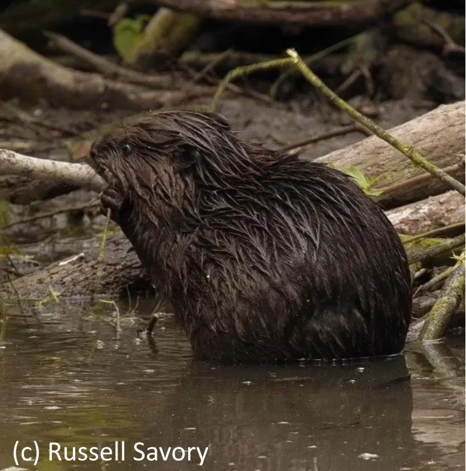
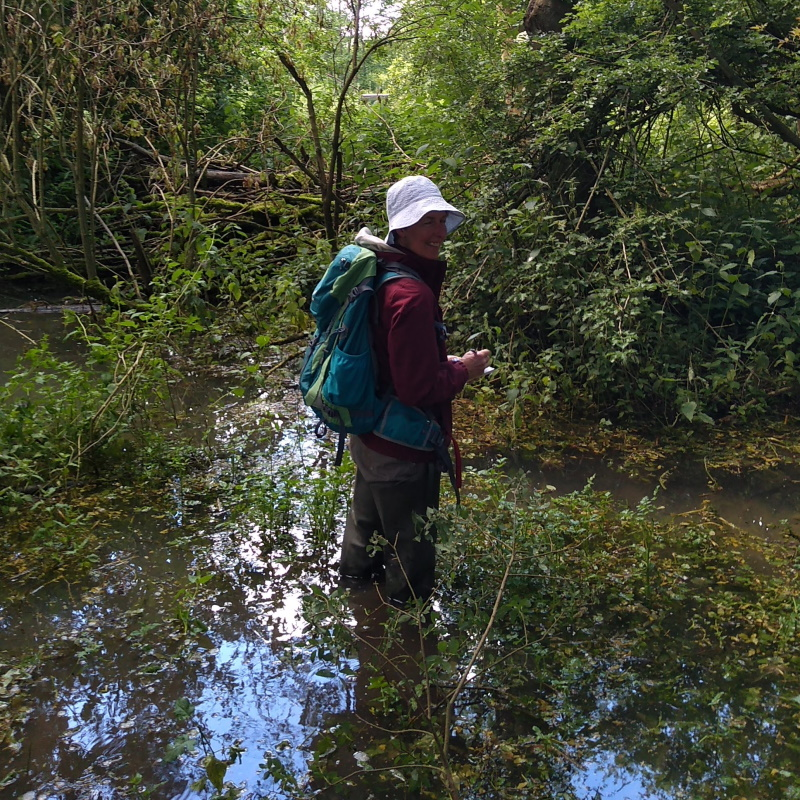
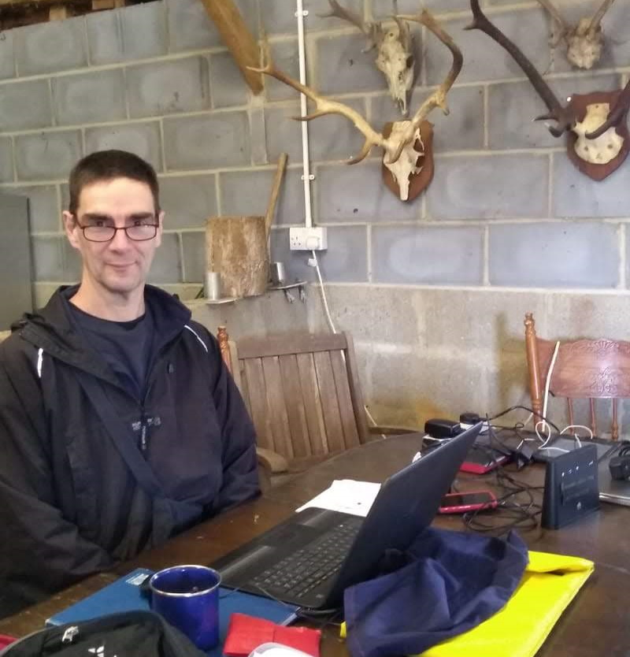

# Beavers, Botany and Biodiversity

A volunteer lead study of the effects of the introduction of beavers
on botany and biodiversity.

## Spains Hall Beavers

Beavers were reintroduced to the [Spains Hall Estate](https://www.spainshallestate.co.uk/nfm_beavers)
in 2019 
as part of a re-wilding and natural flood management programme.
Since then the beavers have started a family
and transformed their environment to suit their needs.

## Botanical Survey

Every year a botanical survey has been conducted to monitor how the botany
of the beaver introduction site has been transformed under beaver management.

## Analysis in Action

This is an on going study and the progress of the analysis in Open Source.
You can take and look an run the analyses yourself at
<https://gitpod.io/#https://github.com/joejcollins/atlanta-shore>.
