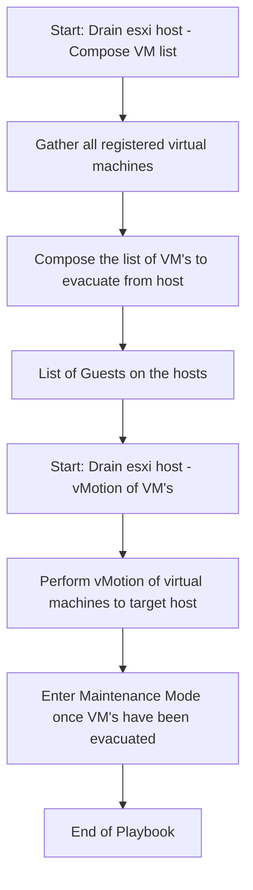

test

```mermaid
graph TD
    A[Start: Drain esxi host - Compose VM list] --> B[Gather all registered virtual machines]
    B --> C[Compose the list of VM's to evacuate from host]
    C --> D[List of Guests on the hosts]
    D --> E[Start: Drain esxi host - vMotion of VM's]
    E --> F[Perform vMotion of virtual machines to target host]
    F --> G[Enter Maintenance Mode once VM's have been evacuated]
    G --> H[End of Playbook]
```